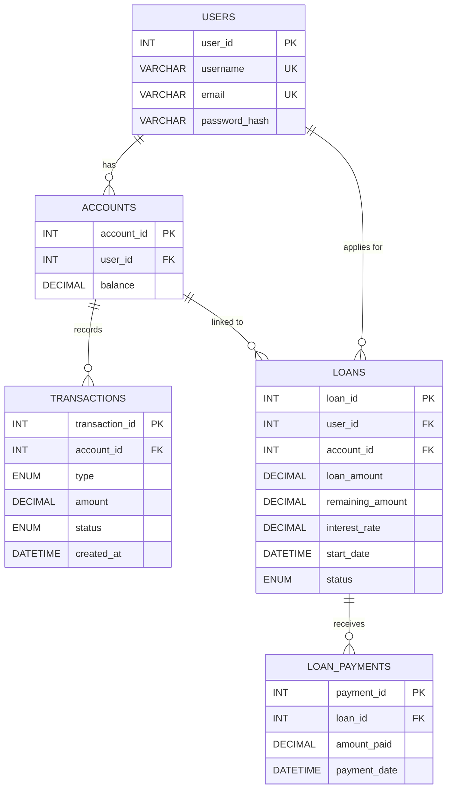

# ER Diagram — Banking System

## Entity-Relationship Diagram

## Relational Schema

| Table | Primary Key | Foreign Keys | Description |
|---|---|---|---|
| `users` | `user_id` | — | System users with credentials |
| `accounts` | `account_id` | `user_id → users` | Bank accounts with balances |
| `transactions` | `transaction_id` | `account_id → accounts` | Deposit/withdrawal records |
| `loans` | `loan_id` | `user_id → users`, `account_id → accounts` | Loan records with interest tracking |
| `loan_payments` | `payment_id` | `loan_id → loans` | Loan repayment records |

## Relationships

- **USERS → ACCOUNTS**: One-to-Many (one user can have multiple accounts; currently one is auto-created)
- **ACCOUNTS → TRANSACTIONS**: One-to-Many (one account has many transactions)
- **USERS → LOANS**: One-to-Many (one user can have multiple loans)
- **ACCOUNTS → LOANS**: One-to-Many (loans are linked to a specific account)
- **LOANS → LOAN_PAYMENTS**: One-to-Many (one loan has many payment records)
